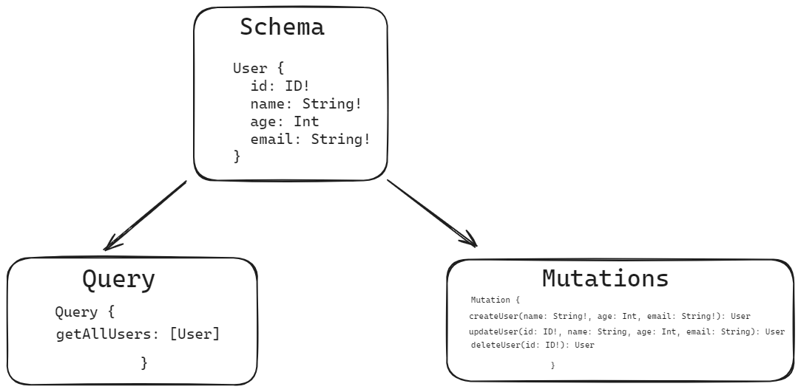

# GraphQl Architecture for Schema

it's is neccessary to define graphql schema for retirve data from database or for mutation also
graphql ke liye uska schema define karna padta hai



# Schema define ke tarika

jab hum graphql m query ya mutation karte hai to hume chahiye rahta hai return value kya hogi aur input (jo user bhejta hai)

query - hume bus return value chahiye rahti hai

mutation - haame return and user input cahiye rahta hai

Note: - jab hume data mangwana hota hai server se to hum query karwate hai data ke basis ya saara data mangwate hai to jab hum
data bhejta hai user input to usko GraphQLInputObjectType ke ander fields m dalte hai ki kon kon si field ka data user se le rahe hai and jab hum waha return data mangwate hai to kon kon sa data hame chahiye use hum GraphQLObjectType m daal debge to hume return m wahi data milega


GraphQLID  -- this is data type  here data type is id
GraphQLString -- this is string
GraphQLNonNull -- ek GraphQL schema language ka ek type hai jo ek nullable type ko wrap karta hai aur ek non-nullable type ko banata hai.

# This is type of output, defined field are response 
```
export const UserType = new GraphQLObjectType({
    name: 'User',
    fields: {
      id: { type: GraphQLID },
      name: { type: GraphQLString },
      email: { type: GraphQLString }
    }
  });
```

# This is type of input, defined field are getting from user aur frontend  
```
  export const UserInputType = new GraphQLInputObjectType({
    name: 'UserInput',
    fields: {
        name: { type: new GraphQLNonNull(GraphQLString) },
        email: { type: new GraphQLNonNull(GraphQLString) },
        phone: { type: new GraphQLNonNull(GraphQLString) },
        password: {type: new GraphQLNonNull(GraphQLString)},
        Cpassword: {type: new GraphQLNonNull(GraphQLString)},
        account_type: {type: new GraphQLNonNull(GraphQLString)},
      }
  })
```

inka use hum user ki query ya mutation dono m use kar sakhte hai

------------------------------------------------------ One More to Achive that -----------------------------------------------------
Old thing
Here type and resolver define seperatly
   ```
   const typeDefs = gql`
  type Query {
      articleList: [Article] # Assuming ArticleListType returns a list of articles
    }

    type Mutation {
      articleCreate: Article
      authorCreate: Author
      DeleteArticle: Article
    }

    type Article {
      # Define Article type fields here
    }

    type Author {
      # Define Author type fields here
    } 
    `
    ```

################################################# These are type of input and Output #################################################


################################################# Now add this type in schema #######################################################
```
import {
  GraphQLID,
  GraphQLInputObjectType,
  GraphQLNonNull,
  GraphQLObjectType,
  GraphQLString,
} from "graphql";

export const UserType = new GraphQLObjectType({
  name: "User",
  fields: {
    id: { type: GraphQLID },
    name: { type: GraphQLString },
    email: { type: GraphQLString },
  },
});

export const UserInputType = new GraphQLInputObjectType({
  name: "UserInput",
  fields: {
    name: { type: new GraphQLNonNull(GraphQLString) },
    email: { type: new GraphQLNonNull(GraphQLString) },
    phone: { type: new GraphQLNonNull(GraphQLString) },
    password: { type: new GraphQLNonNull(GraphQLString) },
    Cpassword: { type: new GraphQLNonNull(GraphQLString) },
    account_type: { type: new GraphQLNonNull(GraphQLString) },
  },
});

export default {
  type: UserType,                                       // Return type aur output type define here 
  args: { type: new GraphQLNonNull(UserInputType) },    // Input type given by frontend 
  resolve: async (_, args,context) => {                 
    return {
      id: 2,
      name: "dee",
      email: "dddddd",
    };
  },
};

```

this is user schema build properly

##################################################### End of building Schema ########################################################


#################################################### Now create schema bunddle #######################################################

```
import { SchemaComposer } from "graphql-compose";           // schemaComposer build easily Query and Mutation bunddle 
import User from "./user.js";
export const createSchema = () => {
  const composer = new SchemaComposer();

  composer.Query.addFields({                               
    users: User,                        // in addFields we can add all query schema so that we can see these in apollo
  });

  return composer.buildSchema();
};
```

############################################################### End ##################################################################


################################################ Now Add Schema bunddle in apollo server ############################################

```
import { ApolloServer } from "@apollo/server";
import { startStandaloneServer } from "@apollo/server/standalone";
import dotenv from "dotenv";
import { db } from "./Database/Db_Connect.js";
import { createSchema } from "./Graphql/Schema/CreateSchema.js";

const serverInt = async () => {
  try {
    dotenv.config();
    await db();

    const schema = createSchema();

    const server = new ApolloServer({
      schema,
    });

    const { url } = await startStandaloneServer(server, {
      listen: { port: 4000 },
    });

    console.log(`🚀  Server ready at: ${url}`);
  } catch (error) {
    throw Error("Error in server starting", error);
  }
};

serverInt();

```